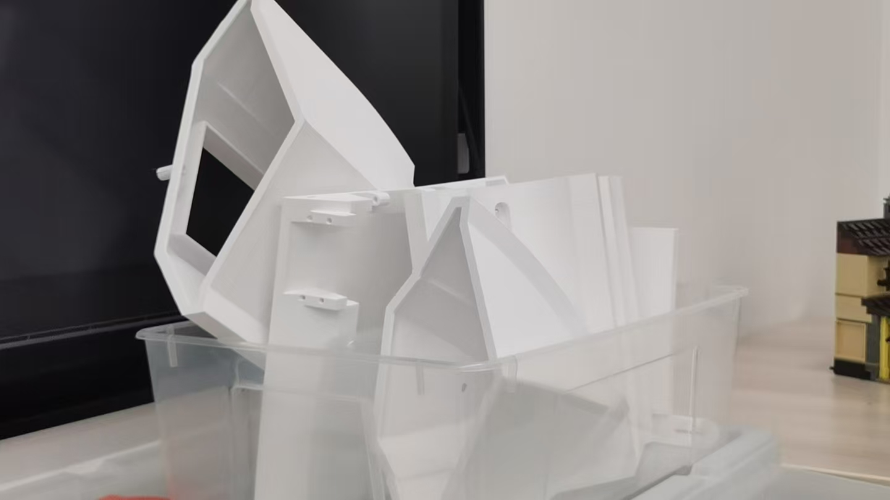

# 3D-Printed Water Monitoring Boat

## Overview

This project was developed during an Innovation Lab activity under the guidance of an instructor, aiming to help students to feel our green campus using sensors.

Our team designed and built a small 3D-printed boat that could float on the surface of water and monitor water conditions that if it is suitable for water plants to grow.

The boat used sensors and Arduino to collect information and displayed the resulting information through an LED display.

---

## My Contribution

I worked with my teammates on the construction and testing of the prototype.

My experience included:

- Working with Arduino
- Integrating sensors into the physical system
- Testing sensor readings
- Working with the LED display
- Assisting with hardware assembly
- Testing the floating prototype
- Participating in debugging and iteration

---

## Technologies

- Arduino
- Sensors
- LED Display
- 3D Printing
- Basic Circuits
- Physical Computing

---

## How It Works

The basic system can be described as:

**Water Environment → Sensors → Arduino → Data Processing → LED Feedback**

The sensors collect information from the surrounding water environment, such as the water pressure and ripples on the water.

Arduino processes the sensor information and the system uses LED screen and a light to display to communicate the resulting condition, if it is suitable, then the light will turn green, otherwise it will turn red.

---

## 3D-Printed Prototype

The boat body was created through 3D printing and designed to float on the water surface for inproving the appearance.

This part of the project allowed me to gain experience connecting digital design with physical prototyping.

---

## What I Learned

This project gave me practical experience with sensors, Arduino, physical computing, and 3D printing assembing.

I also learned that building an interactive physical system requires repeated testing between hardware, software, and the physical environment. For example, we don't know what exactly the threshold should be for a water plant to grow, so my groupmate and me test repeatly to get the specific data that can be written in the code, in order to control the LED light more accurate.

---

## Photos

---

## Reflection

I particularly enjoyed the process of turning sensor information into an output that people could immediately see through the LED display.

This made me interested in how physical environments and human interaction can be connected through computation.
